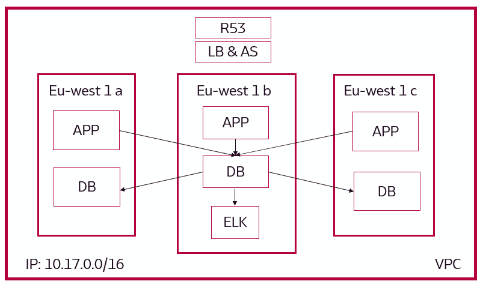
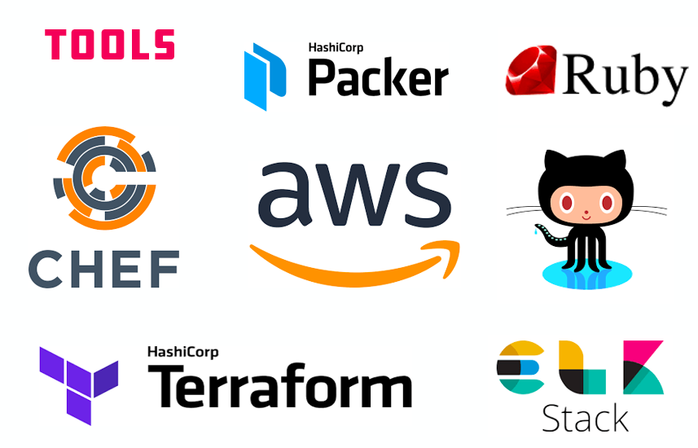

<!-- PROJECT SHIELDS -->
[![Build Status][build-shield]]()
[![Contributors][contributors-shield]]()
[![MIT License][license-shield]][license-url]
[![LinkedIn][linkedin-shield]][linkedin-url]

<!-- PROJECT LOGO -->
 

  

  <h3 align="center">Sparta Global Engineering-29/32 Final Project</h3>

  

    Devops Automation Project
     
    June 2019
     
    <a href="https://www.spartaglobal.com/student-academy/"><strong>Sparta Global Graduate Program »</strong></a>
     
     
    <a href="#">View Demo</a>
    ·
    <a href="https://github.com/aehussey/Sparta-Final-Project-Dev-Ops/issues">Report Bug</a>
    ·
    <a href="https://github.com/aehussey/Sparta-Final-Project-Dev-Ops/issues">Request Feature</a>
  

<!-- TABLE OF CONTENTS -->
## Table of Contents

* [About the Project](#about-the-project)
  * [Built With](#built-with)
* [Getting Started](#getting-started)
  * [Prerequisites](#prerequisites)
  * [Installation](#installation)
* [Usage](#usage)
* [Contributing](#contributing)
* [License](#license)
* [Contact](#contact)
* [Acknowledgements](#acknowledgements)

<!-- ABOUT THE PROJECT -->
## About The Project

Engineering 29/32 were tasked to build a distributed, highly reliable and fault tolerant architecture to provision a NodeJS/MongoDB Application. A high failover was required for the database driven application.

The solution was to develop an architecture using the AWS cloud platform automated with Terraform. The automation aspect allowed the team to build and test the underlying deployment code which increased its robustness. The engineering team proposed the following three elements to meet the architectural requirements.

* AWS ELK (Elastic Search, Logstash and Kibana)
* Multi Availability Zones
* MongoDB Replica Set

A list of commonly used resources that the team found helpful are listed in the acknowledgements.:smile:

### Built With

  

  <h3 align="center">Sparta Global Engineering-29/32 Final Project</h3>

  

Below are a selection of tools was used to build this project.
* [Amazon Web Services](https://aws.amazon.com)
* [Terraform](https://www.terraform.io)
* [Chef](https://www.chef.io/products/chef-infra/)
* [Packer](https://www.packer.io)
* [Ruby](https://www.ruby-lang.org/en/)
* [ELK Stack](https://aws.amazon.com/elasticsearch-service/the-elk-stack/)

<!-- USAGE EXAMPLES -->
## Usage

Use this space to show useful examples of how a project can be used. Additional screenshots, code examples and demos work well in this space. You may also link to more resources.

_For more examples, please refer to the AWS Documentation [Documentation](https://aws.amazon.com/documentation/gettingstarted/)_

<!-- CONTRIBUTING -->
## Contributing

Contributions are what make the open source community such an amazing place to be learn, inspire, and create. Any contributions you make are **greatly appreciated**.

1. Fork the Project
2. Create your Feature Branch (`git checkout -b feature/AmazingFeature`)
3. Commit your Changes (`git commit -m 'Add some AmazingFeature`)
4. Push to the Branch (`git push origin feature/AmazingFeature`)
5. Open a Pull Request

<!-- LICENSE -->
## License

Distributed under the MIT License. See `LICENSE` for more information.

<!-- CONTACT -->
## Contact

Spart Global - [@SpartaGlobal](https://twitter.com/your_username) - enquiries@spartaglobal.com

Project Link: [https://github.com/aehussey/Sparta-Final-Project-Dev-Ops](https://github.com/aehussey/Sparta-Final-Project-Dev-Ops)

<!-- ACKNOWLEDGEMENTS -->
## Acknowledgements
* [Mongo Replica Set](https://medium.com/@greeshu.renu/how-to-setup-three-member-replica-set-on-amazon-ec2-mongodb-60f0aaddcf32)
* [Mongo Replica Set 2](https://hackernoon.com/how-to-setup-replicaset-in-standalone-mongodb-cluster-9cd71a3996fb)
* [Elastic Search](https://github.com/elastic/cookbook-elasticsearch)
* [ELK Stack](https://github.com/Zuehlke/cookbook-elk-stack)

<!-- MARKDOWN LINKS & IMAGES -->
[build-shield]: https://img.shields.io/badge/build-passing-brightgreen.svg?style=flat-square
[contributors-shield]: https://img.shields.io/badge/contributors-1-orange.svg?style=flat-square
[license-shield]: https://img.shields.io/badge/license-MIT-blue.svg?style=flat-square
[license-url]: https://choosealicense.com/licenses/mit
[linkedin-shield]: https://img.shields.io/badge/-LinkedIn-black.svg?style=flat-square&logo=linkedin&colorB=555
[linkedin-url]: https://www.linkedin.com/company/sparta-global
[product-screenshot]: https://raw.githubusercontent.com/othneildrew/Best-README-Template/master/screenshot.png
